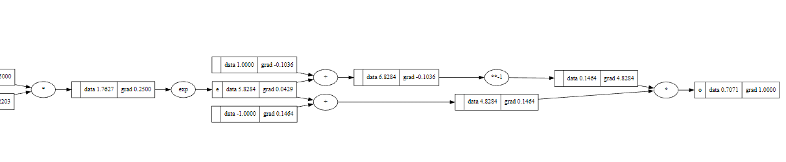
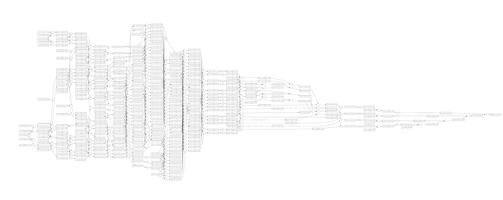

<h1 align="center"> Multi-layer perceptron (MLP) + Autograd engine <h1>

 This repository contains a Multi-layer Perceptron (MLP) + Autograd engine project based on the tutorials from https://github.com/karpathy.
 It is written in Python and uses the PyTorch-like API. The project implements backpropagation (reverse-mode autodiff) over a dynamically built DAG and a small neural networks library.
 It is designed to enable developers to easily create deep neural networks for binary classification tasks. This Code has been used for educational purposes only.

## Technologies Used

- Python

- PyTorch

- Backpropagation

- Binary classification

- Autograd engine

- Neural networks

## How to Use

1. Clone the repository.
2. from srcs.engine import Value to desired python file.
3. Use the Value class to initialize your data.
4. Use the backpropagation method to calculate the gradients through the operations used
5. You can combine this with the usage of the MLP class to generate Multiple Layers of Neurons and train the model accordingly thanks to the gradients

## Index of Useful Resources

- [Andrej Karpathy's youtube channel](https://www.youtube.com/@AndrejKarpathy)
- [PyTorch Tutorials](https://pytorch.org/tutorials/)
- [Neural Networks and Deep Learning](http://neuralnetworksanddeeplearning.com/)
- [Deep Learning Book](http://www.deeplearningbook.org/)
- [Neural Networks and Deep Learning (Coursera)](https://www.coursera.org/learn/neural-networks-deep-learning)
- [Stanford CS231n: Convolutional Neural Networks for Visual Recognition](http://cs231n.stanford.edu/)

## Special Thanks

Dear Andrej Karpathy, Andrew Ng, and Lex Fridman,

I want to express my sincere gratitude to you for inspiring me to learn and explore the fascinating world of machine and deep learning. Your tireless efforts to educate and share your knowledge with the world have made a tremendous impact on my personal and professional growth.

Your work has been a great source of inspiration and motivation for me. Your dedication, passion, and expertise in the field of AI and machine learning have not only been a great source of information, but also a catalyst for my own personal growth and development.

As a student of AI, I have been following your work for years, and it has been a constant source of inspiration for me. Your groundbreaking research and contributions to the field of machine learning have paved the way for a new era of innovation and discovery.

Your educational material, courses, and podcasts have been instrumental in my journey towards mastering the intricacies of machine and deep learning. I have found your work to be a great resource for learning and staying up-to-date with the latest developments in the field.

Through your tireless work and dedication, you have not only helped to advance the field of AI, but also inspired countless others to pursue their own passions and dreams.

I want to thank you for sharing your knowledge and passion with the world. Your contributions have made a profound impact on the way we think and learn about AI, and have helped to shape the future of technology and innovation.

Once again, thank you for your unwavering commitment to educating and inspiring others. Your work has been a constant source of delight and inspiration, and I am grateful for the positive impact you have had on my life and the lives of countless others.

## Author

Manuel Alejandro Grau Bastidas

Desarrollador de Software - Comunidad de Madrid - España

E-mail: manuelgb94@gmail.com

Teléfono: +34 676 18 02 00

https://www.linkedin.com/in/manuel-grau-bastidas/
